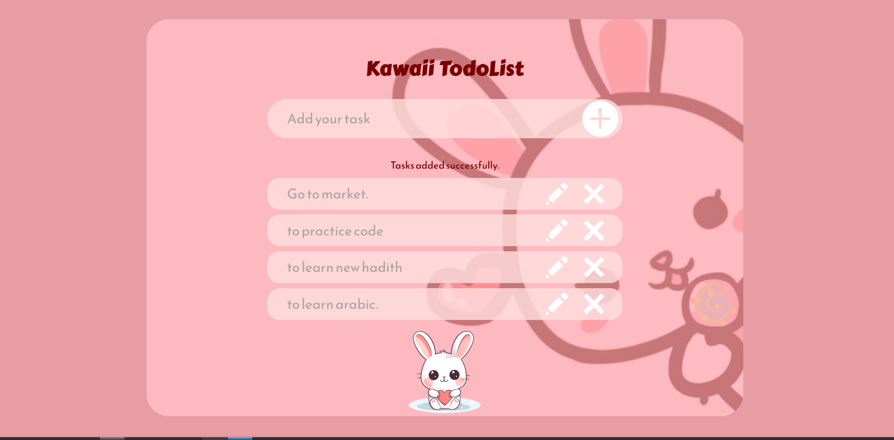
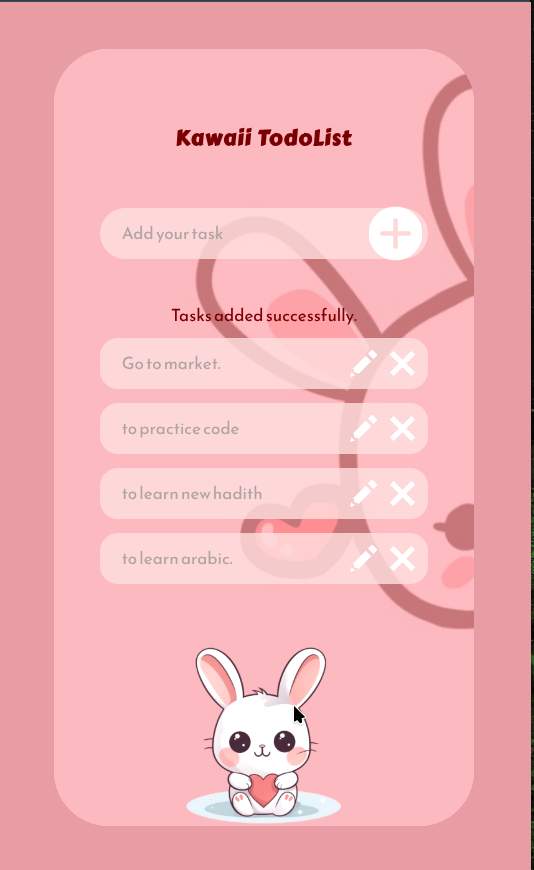

# Kawaii To-Do List

This is a landing page for a To-Do List website. It is not working yet because I did not use JavaScript. I only used HTML and CSS. The page shows a title, an input box, and a button. It is just the design, no real function now.

The page looks good on phone and computer. I used CSS to make it stay in the center and fit the screen.

## Screenshots

## What was easy

Making the layout with HTML and CSS was easy. It was simple to write the code.

## What was hard

Making the background image fit the box was hard. Also, making it look good on all screens was not easy.

## How I did it

First I wrote the HTML, then I added the CSS. I checked the page in the browser and changed the style until it looked okay. I did not add JavaScript yet.
